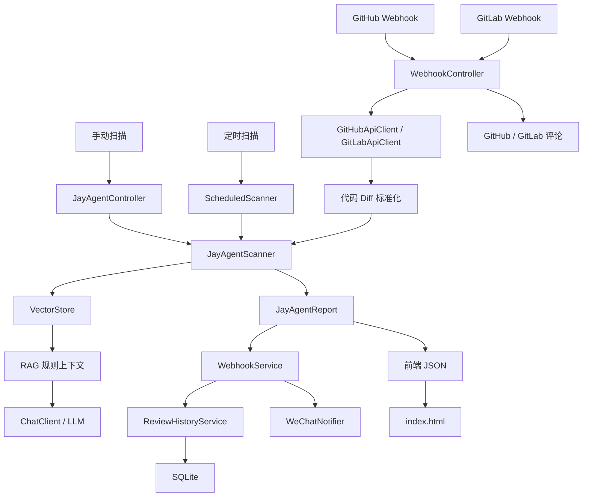

> 历史评估说明：本文记录 2026 年 8 月 19 日的项目状态和风险判断。后续代码已完成部分重构、异步任务持久化、指标建设和 Docker 配置补充；阅读当前状态时请以 README 及最新优化计划为准。

## 总体评价

当前项目已经从“AI 审查 Demo”升级为一个具备完整主流程的代码审查服务，核心功能基本闭环：

```
手动扫描 / GitHub Webhook / GitLab Webhook
                |
                v
        拉取代码变更 Diff
                |
                v
      RAG 检索知识库规则
                |
                v
          LLM 生成审查结果
                |
                v
       结构化风险报告 JayAgentReport
          |           |             |
          v           v             v
       返回前端   回写 PR/MR    保存审查历史
                                      |
                                      v
                                  SQLite 查询
```

按当前代码实现情况，我给项目的综合评分是：

# 8.0 / 10

如果定位为个人学习项目或内部 Demo，已经达到“功能完整、结构清楚、可以演示”的水平；如果定位为团队生产服务，目前还需要继续补强测试、部署可靠性、Webhook 安全策略、并发一致性和可观测性。

---

## 一、项目已经实现的功能

### 1. 手动代码审查

入口：

`POST /api/jayagent/scan`

对应代码：

[JayAgentController.java](/F:/JayAgent/JayAgent-review/src/main/java/com/jayagent/jayagent_review/controller/JayAgentController.java)

当前支持：

- 接收代码 Diff
- 接收文件路径
- 接收审查范围 `reviewScope`
- 对请求字段进行校验
- 调用 AI 审查
- 返回审查分数
- 返回是否存在高风险
- 返回风险列表
- 返回审查摘要
- 返回原始模型结果
- 自动保存手动审查历史

请求模型已经从早期的 `Map<String, String>` 改为专用 DTO：

[JayAgentScanRequest.java](/F:/JayAgent/JayAgent-review/src/main/java/com/jayagent/jayagent_review/controller/dto/JayAgentScanRequest.java)

这是一个比较重要的结构改进，因为入口参数不再依赖字符串键名拼写。

---

### 2. GitHub Pull Request 自动审查

入口：

`POST /api/webhook/github`

对应代码：

[WebhookController.java](/F:/JayAgent/JayAgent-review/src/main/java/com/jayagent/jayagent_review/controller/WebhookController.java)

当前流程是：

1. 接收 GitHub 原始 Webhook JSON
2. 校验请求体大小和 Content-Type
3. 校验 GitHub Delivery ID
4. 校验 `X-Hub-Signature-256`
5. 解析仓库名称
6. 解析 PR 编号
7. 解析分支
8. 解析 commit SHA
9. 解析 PR 地址
10. 调用 GitHub API 获取变更文件
11. 提取文件 Diff
12. 执行 AI 审查
13. 保存带平台上下文的审查历史
14. 如果有高风险，发送企业微信告警
15. 将 Markdown 审查结果回写到 PR 评论区

GitHub 平台上下文包括：

- 仓库名称
- 分支
- commit SHA
- PR 编号
- PR 地址
- Diff hash

---

### 3. GitLab Merge Request 自动审查

入口：

`POST /api/webhook/gitlab`

当前支持：

- 校验 GitLab Event UUID
- 校验 `X-Gitlab-Token`
- 解析项目名称
- 解析 MR IID
- 解析源分支
- 解析最后一次 commit
- 解析 MR URL
- 调用 GitLab API 获取变更
- 提取 Diff
- 执行 AI 审查
- 保存审查上下文
- 发送企业微信高风险告警
- 回写 GitLab MR 评论

GitLab 与 GitHub 的逻辑已经基本统一，这说明平台适配层已经具备了一定的抽象意识。

---

### 4. RAG 知识库检索

核心代码：

[JayAgentScanner.java](/F:/JayAgent/JayAgent-review/src/main/java/com/jayagent/jayagent_review/agent/JayAgentScanner.java)

当前链路是：

```
代码 Diff
  |
  v
构造检索 Query
  |
  v
VectorStore 相似度检索
  |
  v
过滤低于 min-score 的结果
  |
  v
拼接规则文本
  |
  v
注入 Prompt
  |
  v
调用 ChatClient
```

当前会根据代码内容增加检索关键词，例如：

- `password`
- `secret`
- `key`
- `token`
- `SQL`
- `Statement`
- `jdbc`
- `log`
- `print`
- `logger`

知识库文件是：

[java_security_rules.txt](/F:/JayAgent/JayAgent-review/src/main/resources/knowledge/java_security_rules.txt)

当前 RAG 主要用于辅助模型识别：

- 敏感信息
- 硬编码密钥
- SQL 注入
- 日志敏感信息泄露
- 依赖和规则相关风险

---

### 5. LLM 审查和结构化解析

项目使用 Spring AI 的 `ChatClient`，支持：

- OpenAI 兼容接口
- DeepSeek 配置
- Ollama 模型依赖
- Embedding 模型
- Elasticsearch VectorStore

模型输出会被解析成：

```
JayAgentReport
```

报告中目前包含：

- `reviewScope`
- `score`
- `highRisk`
- `summary`
- `rawAnalysis`
- `risks`

单条风险项包含：

- 风险等级
- 位置
- 标题
- 描述
- 修复建议
- 风险图标
- 规则 ID
- 风险分类
- 严重度分数
- 置信度
- 来源上下文

相比最初只保存 `level/title/description/suggestion`，当前结果已经明显更适合前端展示、统计和历史追踪。

---

### 6. 风险评分

评分配置在：

[RiskScoringConfig.java](/F:/JayAgent/JayAgent-review/src/main/java/com/jayagent/jayagent_review/config/RiskScoringConfig.java)

配置文件中可以调整：

```
app:
  jayagent:
    scoring:
      critical-penalty: 25
      high-penalty: 10
      medium-penalty: 5
      low-penalty: 1
```

当前评分思路是：

```
100
- CRITICAL 数量 × criticalPenalty
- HIGH 数量 × highPenalty
- MEDIUM 数量 × mediumPenalty
- LOW 数量 × lowPenalty
```

最终分数不会低于 0。

这已经从早期硬编码评分，升级成了可配置评分策略。

---

### 7. Webhook 安全控制

当前已实现：

- GitHub HMAC SHA-256 签名校验
- GitLab Token 校验
- 通用共享 Token 兜底
- Delivery ID / Event UUID 校验
- Content-Type 校验
- 请求体最大长度限制
- 常量时间签名比较
- 原始请求体参与签名校验

配置位于：

[application.yml](/F:/JayAgent/JayAgent-review/src/main/resources/application.yml)

这是目前项目中安全性提升最明显的一部分。

---

### 8. Webhook 幂等去重

当前已经不是简单的内存 `Set`，而是抽象成：

[WebhookEventDedupStore.java](/F:/JayAgent/JayAgent-review/src/main/java/com/jayagent/jayagent_review/controller/WebhookEventDedupStore.java)

实际实现：

[FileWebhookEventDedupStore.java](/F:/JayAgent/JayAgent-review/src/main/java/com/jayagent/jayagent_review/controller/FileWebhookEventDedupStore.java)

当前行为：

- 启动时读取历史事件 key
- 使用内存集合快速判断
- 新事件写入 `data/webhook-events.log`
- 重复事件直接返回 `duplicate: true`
- 避免重复审查、重复评论、重复告警

这解决了应用重启后内存去重失效的问题。

---

### 9. 审查历史 SQLite 存储

核心代码：

[ReviewHistoryService.java](/F:/JayAgent/JayAgent-review/src/main/java/com/jayagent/jayagent_review/service/ReviewHistoryService.java)

当前已经完成：

- 从 JSONL 切换到 SQLite
- 启动自动建表
- 审查记录写入 SQLite
- 历史记录分页查询
- 按来源筛选
- 按平台筛选
- 按仓库筛选
- 按审查范围筛选
- 按风险状态筛选
- 按分数范围筛选
- 详情查询
- 统计数据
- 趋势数据
- 保留旧 JSONL 迁移能力

默认配置：

```
app:
  review-history:
    database-file: data/review-history.db
    legacy-file: data/review-history.jsonl
```

历史记录当前保存的不是代码文件版本，而是审查记录和代码版本引用：

- 审查时间
- 审查来源
- 平台
- 仓库
- 分支
- commit SHA
- PR 编号
- MR IID
- 源地址
- Diff hash
- 审查范围
- 文件路径
- 评分
- 风险状态
- 风险数量
- 风险明细
- 模型原始输出
- 分析耗时

这符合项目之前确定的原则：不复制 GitHub/GitLab 的文件版本历史，只保存审查上下文和引用信息。

---

### 10. 知识库生命周期控制

代码：

[KnowledgeBaseInitializer.java](/F:/JayAgent/JayAgent-review/src/main/java/com/jayagent/jayagent_review/rag/KnowledgeBaseInitializer.java)

当前通过源文件 SHA-256 记录知识库状态：

```
知识库源文件未变化 -> 跳过重复入库
知识库源文件发生变化 -> 重新分块并写入
```

状态文件：

```
data/knowledge-base-state.txt
```

解决了每次启动都重复写入向量库的问题。

---

### 11. 企业微信告警

代码：

[WeChatNotifier.java](/F:/JayAgent/JayAgent-review/src/main/java/com/jayagent/jayagent_review/integration/WeChatNotifier.java)

当前支持：

- Webhook Key 环境变量配置
- 高风险审查告警
- Markdown 消息
- 项目名称
- PR/MR 信息
- 评分
- 高风险提示
- 告警失败日志记录
- 告警失败不影响主审查结果

这一点的设计是合理的：通知属于附加能力，不应成为审查主流程的单点故障。

---

### 12. 前端 Demo

前端文件：

[index.html](/F:/JayAgent/JayAgent-review/src/main/resources/static/index.html)

当前已经支持：

- 手动提交代码 Diff
- 输入文件路径
- 选择审查范围
- 展示评分
- 展示高风险状态
- 展示风险列表
- 展示审查摘要
- 查询审查历史
- 历史分页
- 历史筛选
- 查看审查详情
- 展示平台上下文
- 展示仓库、分支、commit
- 展示 PR/MR 编号
- 展示 Diff hash
- 跳转源 PR/MR 地址

对于学习项目来说，前端已经不再只是一个简单请求 Demo，而是具备了基础产品形态。

---

## 二、当前项目架构

### 1. 分层结构

```
com.jayagent.jayagent_review
|
+-- controller
|   +-- JayAgentController
|   +-- WebhookController
|   +-- ReviewHistoryController
|   +-- SearchController
|   +-- ChatController
|   +-- RuleController
|   +-- FileWebhookEventDedupStore
|
+-- service
|   +-- WebhookService
|   +-- ReviewHistoryService
|
+-- agent
|   +-- JayAgentScanner
|   +-- JayAgentReport
|   +-- ScheduledScanner
|
+-- rag
|   +-- DocumentLoader
|   +-- KnowledgeBaseInitializer
|
+-- integration
|   +-- GitHubApiClient
|   +-- GitLabApiClient
|   +-- WeChatNotifier
|   +-- ExternalApiException
|
+-- config
    +-- AiConfig
    +-- JayAgentProperties
    +-- RiskScoringConfig
```

### 2. 主要架构关系[[主要架构关系.canvas]]





### 3. 项目的架构特点

当前架构属于：

```
Spring Boot 单体应用
+ Spring AI
+ Elasticsearch VectorStore
+ SQLite 审查历史
+ GitHub/GitLab 外部适配器
+ 静态前端
```

它不是微服务架构，也不是事件驱动架构。所有能力都运行在一个 Spring Boot 进程内。

这对当前项目是合理的，因为项目目前重点是：

- 学习 AI 代码审查
- 理解 RAG
- 理解 Webhook
- 理解第三方 API 集成
- 快速验证产品流程

---

## 三、项目的优点

### 1. 主业务链路完整

项目不是只调用一次 LLM，而是完成了：

```
Webhook
-> 获取代码变更
-> Diff 处理
-> RAG 检索
-> Prompt 构造
-> LLM 审查
-> 结果解析
-> 风险评分
-> 历史保存
-> 评论回写
-> 企业微信通知
```

这条链路已经具备完整的项目学习价值。

---

### 2. 模块职责划分比较清晰

目前至少可以看出以下边界：

- Controller 负责入口和请求解析
- Service 负责业务编排
- Scanner 负责 AI 审查
- RAG 包负责知识库
- Integration 包负责外部系统
- Config 包负责配置
- ReviewHistoryService 负责历史数据

虽然还没有进一步拆成更细的领域模块，但对于当前规模已经比较清楚。

---

### 3. 平台接入具有可扩展性

GitHub 与 GitLab 已经各自封装为独立客户端：

- GitHub API 逻辑不会散落在业务层
- GitLab API 逻辑不会散落在 Controller
- 后续接入 Gitee、Bitbucket 或企业内部 Git 平台时，有明确扩展位置

---

### 4. 已经考虑了失败路径

相比只实现成功流程，项目已经增加了：

- 无效 JSON 处理
- Webhook 鉴权失败处理
- Payload 超限处理
- 外部 API 异常包装
- 企业微信告警失败隔离
- Diff 解析失败降级
- 知识库状态文件读取失败降级
- 去重文件读取失败降级

这让项目具备了一定的工程意识。

---

### 5. 审查结果已经结构化

`JayAgentReport` 不是简单返回一段模型文本，而是将模型结果转换成了可查询、可展示的结构。

这为后续功能提供了基础：

- 风险统计
- 历史趋势
- 风险类型分布
- 前端筛选
- 风险追踪
- 自动修复
- 团队治理报表

---

### 6. 结果具备一定可解释性

当前风险结果不仅包含标题和描述，还可以保存：

- 风险类别
- 规则 ID
- 置信度
- 严重度分数
- 规则来源
- 来源上下文

同时历史记录还保存了：

- commit SHA
- PR/MR 地址
- Diff hash
- 仓库
- 分支

这使审查结果可以回溯到真实代码平台。

---

### 7. SQLite 选型适合当前阶段

SQLite 对当前项目的优点是：

- 不需要独立数据库服务
- 本地部署简单
- 适合学习和单机运行
- 支持分页、筛选、索引
- 比 JSONL 更容易查询
- 后续可以迁移到 PostgreSQL 或 MySQL

当前没有复制 GitHub/GitLab 的版本历史，而是保存审查记录和版本引用，这个边界判断是合理的。

---

### 8. 配置治理已经有明显改进

以下内容已经配置化：

- Webhook secret
- GitHub secret
- GitLab token
- Webhook 严格模式
- Payload 最大长度
- Event ID 要求
- 知识库源文件
- 知识库状态文件
- 向量检索阈值
- 风险扣分规则
- SQLite 数据库路径

这降低了修改策略时必须改源码的成本。

---

### 9. 编码和 Java 版本问题已经解决

`pom.xml` 中已经明确配置：

```
<java.version>17</java.version>
<maven.compiler.release>17</maven.compiler.release>
<project.build.sourceEncoding>UTF-8</project.build.sourceEncoding>
```

此前本地验证已经得到：

```
Compiling 24 source files with javac [debug release 17]
BUILD SUCCESS
```

说明主源码编译链路是通的。

---

## 四、当前项目的不足和风险

下面分为架构不足和实现不足。

## A. 架构层面的不足

### 1. WebhookController 仍然偏重

当前 `WebhookController` 同时负责：

- 鉴权
- 原始请求约束
- JSON 解析
- GitHub payload 解析
- GitLab payload 解析
- Diff 提取
- 上下文构建
- 去重
- 调用外部 API
- 调用审查服务
- 构造 HTTP 响应

这说明 Controller 已经承担了过多业务职责。

建议后续拆分为：

```
WebhookController
  -> WebhookSecurityService
  -> GitHubWebhookParser
  -> GitLabWebhookParser
  -> WebhookReviewOrchestrator
  -> PlatformCommentService
```

当前还能维护，但后续增加第三个平台时，Controller 会快速膨胀。

---

### 2. 领域模型和传输模型没有完全分离

目前一些接口直接返回：

```
Map<String, Object>
```

例如手动扫描和 Webhook 响应。

问题是：

- 字段缺乏编译期约束
- Swagger/OpenAPI 不容易生成准确文档
- 字段改名容易产生运行时问题
- 测试不够直观

建议后续增加：

- `JayAgentScanResponse`
- `WebhookReviewResponse`
- `ReviewHistoryPageResponse`
- `RiskItemResponse`

---

### 3. RAG、LLM、结果解析仍集中在 JayAgentScanner

`JayAgentScanner` 目前同时负责：

- 检索 Query 构造
- VectorStore 检索
- 上下文拼接
- Prompt 构造
- LLM 调用
- 输出解析
- 风险容错
- 结果统计

对于学习阶段很直观，但生产维护时职责过重。

后续可以拆分：

```
ReviewQueryBuilder
KnowledgeRetriever
PromptTemplateService
LlmReviewClient
ReviewResultParser
RiskReportAssembler
```

---

### 4. SQLite、向量库和文件状态都属于本地存储

当前数据分散在：

```
data/review-history.db
data/webhook-events.log
data/knowledge-base-state.txt
Elasticsearch VectorStore
```

这是一种适合单机 Demo 的结构，但部署到多实例时会产生问题：

- 每个实例有自己的 SQLite 文件
- 每个实例有自己的去重日志
- 本地状态不共享
- 容器重启可能丢失数据
- 多实例可能重复处理同一个 Webhook

如果未来需要横向扩展，应将以下内容迁移到共享基础设施：

- 审查历史：PostgreSQL/MySQL
- 幂等记录：Redis 或关系数据库
- 知识库：共享 Elasticsearch
- 文件状态：数据库或对象存储

---

### 5. 可观测性还没有形成完整体系

虽然代码中已有耗时日志，例如：

```
reviewScope
filePath
score
costMs
```

但还没有看到完整的指标体系，例如：

- 审查总次数
- 审查成功次数
- 审查失败次数
- LLM 调用耗时
- RAG 检索耗时
- GitHub API 失败次数
- GitLab API 失败次数
- 企业微信告警失败次数
- Webhook 重复次数
- 风险等级分布

当前属于“有日志”，还没有真正做到“可观测”。

---

## B. 实现层面的不足

### 1. Webhook 认证默认配置仍有安全隐患

当前配置是：

```
strict-mode: true
allow-shared-secret-fallback: true
```

而代码中：

```
if (sharedSecret.isBlank()) {
    return;
}
```

这意味着在以下情况下：

- GitHub secret 没配置
- GitLab token 没配置
- shared secret 也没配置

请求可能不会被拒绝。

虽然默认部署时可以通过环境变量配置密钥，但代码的默认行为不够安全。严格模式应该在没有任何有效凭证时直接拒绝请求，而不是放行。

建议改为：

```
没有平台密钥
且没有共享密钥
且 strict-mode=true
=> 直接返回 401
```

这是目前最值得继续修复的安全问题之一。

---

### 2. Webhook 去重备用 hash 使用 `String.hashCode()`

当前 fallback 逻辑类似：

```
Integer.toHexString(rawBody.hashCode())
```

Java 的 `String.hashCode()` 只有 32 位，而且存在碰撞可能。

这可能导致：

- 两个不同 Webhook 被误判为重复
- 去重准确性不足
- 长期排障困难

建议统一使用 SHA-256：

```
platform + ":" + SHA-256(rawBody)
```

这和项目在 `diffHash` 中采用 SHA-256 的做法保持一致。

---

### 3. 文件型去重存储仍会无限增长

[FileWebhookEventDedupStore.java](/F:/JayAgent/JayAgent-review/src/main/java/com/jayagent/jayagent_review/controller/FileWebhookEventDedupStore.java)

当前行为是：

- 每个事件永久写入日志
- 启动时全部加载到内存
- 没有 TTL
- 没有清理策略
- 没有最大记录数
- 没有按时间分区

当系统长期运行时：

- 文件会持续增长
- 启动加载时间变长
- 内存占用持续增长
- 老事件永远不会过期

建议后续加入：

- TTL，例如 7 天或 30 天
- 按日期分文件
- 定期清理任务
- 或直接迁移 Redis / SQLite

---

### 4. 文件去重在多实例环境下仍不可靠

虽然已经从内存 Set 升级成文件，但它仍然不是分布式幂等方案。

两个应用实例可能同时处理相同事件：

```
实例 A 检查不存在
实例 B 检查不存在
实例 A 写入
实例 B 写入
```

当前 `synchronized` 只能保证单 JVM 内的线程安全，不能保证多进程、多容器之间的原子性。

如果项目未来部署多实例，需要使用：

- Redis `SETNX`
- 数据库唯一索引
- 分布式锁
- 消息队列消费幂等

---

### 5. 知识库状态文件对打包部署可能不可靠

`KnowledgeBaseInitializer` 中通过：

```
Paths.get("src/main/resources").resolve(sourcePath)
```

读取知识库源文件。

这在开发目录下可以工作，但打包成 JAR 后，知识库文件通常位于 JAR 内部，不再是操作系统上的：

```
src/main/resources/...
```

因此可能出现：

- 本地运行正常
- Maven 打包后启动失败
- Docker 镜像中找不到源文件
- 状态 hash 无法计算

建议使用 Spring `ResourceLoader` 或 `ClassPathResource` 读取资源：

```
Resource resource = resourceLoader.getResource("classpath:" + sourcePath);
```

如果知识库未来要支持动态更新，建议把规则文件放到外部配置目录或对象存储。

---

### 6. 知识库更新可能造成旧向量残留

当前知识库文件发生变化后会执行：

```
vectorStore.add(documents);
```

但从代码表现看，没有明确删除旧版本向量。

这可能导致：

```
旧规则向量 + 新规则向量
```

长期累积。

结果可能是：

- 检索命中旧规则
- 规则重复
- 向量库膨胀
- 同一规则多个版本同时参与 Prompt

建议后续增加：

- 文档版本字段
- sourceId
- version
- 文档 hash
- 按 sourceId 删除旧文档
- 再写入新文档

---

### 7. 外部 API 客户端仍缺少完整超时和重试治理

GitHub、GitLab 和企业微信虽然已经有统一异常类型：

[ExternalApiException.java](/F:/JayAgent/JayAgent-review/src/main/java/com/jayagent/jayagent_review/integration/ExternalApiException.java)

但还需要确认和补充：

- 连接超时
- 读取超时
- 请求超时
- 有限次数重试
- 指数退避
- 429 限流处理
- 5xx 重试
- 4xx 快速失败
- 统一错误响应
- Correlation ID

目前统一异常更多是“包装异常”，还不等于完整的可靠性治理。

---

### 8. Webhook 主流程可能同步执行时间过长

当前 Webhook 请求内同步执行：

```
接收 Webhook
-> 拉 GitHub/GitLab
-> RAG
-> 调 LLM
-> 发企业微信
-> 回写评论
-> 返回响应
```

如果 LLM 响应慢，Webhook 平台可能会：

- 请求超时
- 自动重试
- 触发重复事件
- 造成审查重复执行

更适合生产的方案是：

```
Webhook 接收
-> 鉴权
-> 去重
-> 快速返回 202
-> 异步任务队列
-> 后台审查
-> 回写评论
```

可选技术：

- Spring `@Async`
- `TaskExecutor`
- Redis Stream
- RabbitMQ
- Kafka

---

### 9. 代码 Diff 处理仍有边界问题

当前主要提取：

- GitHub `patch`
- GitLab `diff`

但有些文件可能没有可用 patch，例如：

- 二进制文件
- 文件过大
- GitHub patch 被截断
- GitLab 返回空 diff
- 重命名文件
- 删除文件
- 新增文件无完整上下文

现在对空 Diff 的处理比较简单，可能导致：

- 审查空内容
- 模型误判为通过
- 结果缺少文件定位
- 大型 PR 内容被截断

建议增加：

- Diff 最大长度配置
- 文件数量限制
- 单文件最大长度
- 二进制文件跳过标识
- 截断提示
- 空 Diff 明确返回
- 文件级审查任务拆分

---

### 10. Prompt 仍然依赖文本协议解析

即使 `parseReport()` 已经增加了容错，当前模型结果仍然依赖特定文本格式。

潜在问题：

- 模型输出 Markdown
- 模型输出代码块
- 字段中包含 `|`
- 风险描述换行
- 模型输出 JSON
- 模型漏掉字段
- 模型将风险等级写成中文
- 模型输出额外解释

更稳的方案是：

- 使用结构化输出
- 使用 JSON Schema
- 使用 Spring AI entity 映射
- 对枚举字段做统一归一化
- 对缺失字段设置默认值
- 对非法风险项记录解析失败原因

当前方案适合 Demo，但不是最稳的生产方案。

---

### 11. 评分模型仍然比较简单

当前评分基于风险数量扣分，存在一些局限：

- 同类风险重复出现会线性扣分
- 风险位置敏感度没有参与
- 置信度没有参与
- 风险是否已经确认没有参与
- MEDIUM 和 LOW 影响较轻
- 不同规则的业务影响没有区分
- 一个高危问题和多个低危问题的解释能力有限

后续可以考虑：

```
最终分数 =
风险等级权重
+ 规则权重
+ 文件敏感度
+ 置信度
+ 重复风险折扣
```

---

### 12. 手动审查历史上下文仍然较少

Webhook 审查可以保存：

- 平台
- 仓库
- 分支
- commit
- PR/MR
- sourceUrl
- diffHash

但是手动审查仍然主要保存：

- source
- filePath
- reviewScope
- report

这符合“手动入口不强制平台字段”的设计，但如果希望长期追踪手动审查，建议增加可选字段：

- 用户名
- 项目名
- 分支
- 本地 commit
- 上传来源
- 客户端请求 ID

---

### 13. 数据库访问层还没有完全抽象

`ReviewHistoryService` 当前同时负责：

- SQLite 建表
- SQL 插入
- SQL 查询
- SQL 统计
- JSONL 迁移
- DTO 组装
- 风险序列化
- 数据库连接管理

这使 `ReviewHistoryService` 代码较长，职责偏重。

建议后续拆分为：

```
ReviewHistoryService
ReviewHistoryRepository
ReviewHistoryRowMapper
ReviewHistoryMigration
ReviewHistoryQueryBuilder
```

这样未来从 SQLite 切换到 PostgreSQL 时，业务层不需要大幅修改。

---

### 14. 测试覆盖仍不足

当前测试文件已经存在：

- `JayAgentReportTest`
- `JayAgentScannerTest`
- `JayAgentScanRequestTest`
- `JayAgentApplicationTests`

但从项目复杂度来看，仍缺少关键测试：

- GitHub 签名正确/错误
- GitLab Token 正确/错误
- Webhook 缺少 Event ID
- Webhook 重复事件
- GitHub payload 解析
- GitLab payload 解析
- Diff 提取异常
- SQLite 建表
- SQLite 写入和查询
- JSONL 迁移
- 历史筛选和分页
- 企业微信失败不影响主流程
- 外部 API 异常映射
- 知识库文件未变化时跳过入库

当前主源码已经通过过：

```
mvn -U -DskipTests compile
```

但这只验证了主源码编译，不等价于全部测试通过。测试还应该单独执行：

```
mvn test
```

---

### 15. 依赖版本管理还可以更规范

当前 `pom.xml` 中直接写了多个版本：

- Spring Boot
- Spring AI
- Elasticsearch
- SQLite
- Surefire
- Compiler Plugin

项目目前可以工作，但后续建议：

- 使用 Spring Boot parent 或 dependency management
- 统一管理版本
- 避免 Spring AI milestone 版本和稳定版本混用
- 增加依赖漏洞扫描
- 固定 Maven Wrapper 版本
- 增加构建 profile

目前项目名称和包名也存在轻微不一致：

```
包名：jayagent_review
artifactId：jayagent-review
name：jayagent-review
```

包名已经完成迁移，但 Maven 工程标识仍保留旧名称。功能上不影响编译，但长期维护时容易造成认知混乱。

---

### 16. 缺少统一 API 错误响应

当前异常大多直接由 Spring 默认机制处理，或者返回简单的：

```
ResponseStatusException
```

建议统一返回：

```
{
  "success": false,
  "code": "WEBHOOK_SIGNATURE_INVALID",
  "message": "Invalid GitHub webhook signature",
  "requestId": "..."
}
```

这样前端、GitHub/GitLab Webhook、日志系统更容易统一处理。

---

### 17. API 鉴权范围仍不完整

Webhook 有签名和 Token 校验，但手动接口、搜索接口、聊天测试接口、规则刷新接口是否需要鉴权，需要进一步明确。

当前这些接口可能包括：

- `/api/jayagent/scan`
- `/api/search/test`
- `/api/chat/test`
- `/api/rules/refresh`
- `/api/review-history/**`

如果服务暴露在团队网络中，任何人都可能：

- 调用 LLM 消耗额度
- 查询审查历史
- 刷新知识库
- 获取原始模型结果

建议增加：

- 管理接口鉴权
- API Key
- Spring Security
- 角色控制
- 脱敏策略
- 生产环境禁用测试接口

---

## 五、当前项目功能完成度

| 功能领域         | 完成度 | 评价                  |
| ------------ | --- | ------------------- |
| 手动代码审查       | 90% | 主流程完整，DTO 校验已具备     |
| GitHub PR 审查 | 85% | 拉取、分析、评论、上下文已完成     |
| GitLab MR 审查 | 85% | 与 GitHub 基本对齐       |
| RAG 检索       | 80% | 能工作，但知识库版本治理仍可加强    |
| Prompt 和结果解析 | 75% | 有容错，但结构化输出仍不够稳      |
| 风险评分         | 75% | 已配置化，但模型较简单         |
| Webhook 安全   | 80% | 已有原生校验，但默认放行风险需修复   |
| Webhook 幂等   | 75% | 已持久化，但文件方案不适合多实例    |
| SQLite 历史    | 85% | 已具备查询、分页、迁移和上下文     |
| 企业微信通知       | 75% | 已隔离失败，但超时重试需加强      |
| 前端 Demo      | 80% | 有历史筛选和详情页，仍是单页 Demo |
| 测试体系         | 55% | 有基础测试，关键集成测试不足      |
| 可观测性         | 50% | 有日志，缺少完整指标和链路追踪     |
| 生产部署能力       | 60% | 单机可用，多实例和异步化不足      |

---

## 六、最需要优先处理的问题

### P0：生产安全

1. 没有任何 secret 时，Webhook 严格模式仍可能放行。
2. 手动扫描、搜索、规则刷新等接口缺少统一鉴权。
3. 原始模型输出可能包含敏感代码信息，需要明确脱敏和访问权限。

### P1：稳定性

1. Webhook 同步执行 LLM，容易超时和被平台重复重试。
2. 外部 API 的超时、重试、限流还不完整。
3. 文件型去重日志没有 TTL，也不支持多实例。
4. 知识库更新时可能遗留旧向量。

### P1：测试

1. 缺少 Webhook 签名和 Token 测试。
2. 缺少 GitHub/GitLab Payload 解析测试。
3. 缺少 SQLite 集成测试。
4. 缺少外部系统异常测试。
5. 缺少知识库重复初始化测试。

### P2：可维护性

1. `WebhookController` 过重。
2. `JayAgentScanner` 过重。
3. `ReviewHistoryService` 过重。
4. 多处仍返回 `Map<String, Object>`。
5. 缺少统一异常响应对象和 API 文档。

---

## 七、最终结论

这个项目目前已经具备一个完整的 AI 代码审查产品雏形：

```
它不只是“调用 LLM 分析代码”，
而是已经包含：
平台 Webhook 接入、
Diff 获取、
RAG 检索、
LLM 分析、
风险结构化、
评分、
评论回写、
企业微信告警、
SQLite 历史、
分页筛选、
详情追踪、
知识库生命周期管理。
```

它的最大优点是业务链路完整、学习价值高、优化过程有清晰记录；最大不足是还没有完全从“单机可用”进化到“多实例生产可用”。

下一阶段不建议继续大量添加新功能，应该集中在四件事：

1. 补齐 Webhook 和管理接口的安全边界。
2. 把同步审查改成可控的异步任务。
3. 增加关键链路的集成测试。
4. 将日志升级为指标、追踪和统一错误响应。

如果以学习项目评估，它已经是一个完成度较高的 Spring Boot + Spring AI + RAG 综合项目；如果以生产项目评估，当前更准确的定位是“具备生产架构雏形的单体服务”，而不是最终生产版本。
